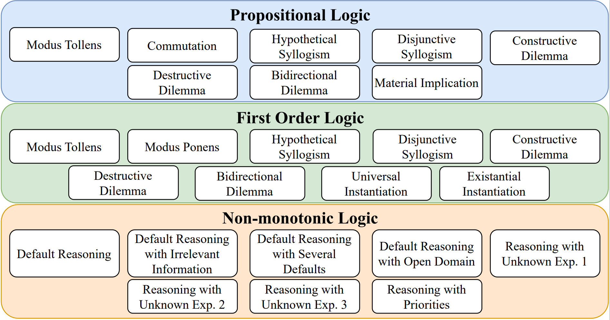

# LogicBench: Towards Systematic Evaluation of Logical Reasoning Ability of Large Language Models

We comprehensively evaluate the logical reasoning ability of LLMs on 25 different reasoning patterns spanning over propositional, first-order, and non-monotonic logics. To enable systematic evaluation, we introduce LogicBench, a natural language question-answering dataset focusing on the use of a single inference rule. We conduct detailed analysis with a range of LLMs such as GPT-4, ChatGPT, Gemini, Llama-2, and Mistral using chain-of-thought prompting. Experimental results show that existing LLMs do not fare well on LogicBench; especially, they struggle with instances involving complex reasoning and negations. We believe that our work and findings facilitate future research for evaluating and enhancing the logical reasoning ability of LLMs.

## Data Release

**Licence:** MIT License

**LogicBench is Available on Huggingface:** https://huggingface.co/datasets/cogint/LogicBench-v1.0

**Scope of the dataset:** As shown below, LogicBench covers 25 inference rules/reasoning patterns spanning propositional, first-order, and non-monotonic logic.



We introduce two versions of our proposed dataset: LogicBench(Eval) and LogicBench(Aug). ```data/``` contains both versions of the dataset and is distributed in the folder as follows:

    ├── ...
    ├── data
        ├── LogicBench(Aug)
        │   ├── first_order_logic
        │   ├── nm_logic
        │   └── propositional_logic
        └── LogicBench(Eval)
            ├── BQA
            |   ├── propositional_logic
            |   ├── first_order_logic
            |   └── nm_logic
            └── MCQA
                ├── propositional_logic
                ├── first_order_logic
                └── nm_logic
            

In all these folders, the JSON file corresponding to each inference rule is formatted as below:

### JSON file format

```JSON
{
    "type": "str",
    "axiom": "str",
    "samples": [
        {
            "id": "int",
            "context": "str",
            "qa_pairs": [
                {
                    "question": "str",
                    "answer": "str"
                },
                {
                    "question": "str",
                    "answer": "str"
                }
            ]
        },
        {
            "id": "int",
            "context": "str",
            "qa_pairs": [
                {
                    "question": "str",
                    "answer": "str"
                },
                {
                    "question": "str",
                    "answer": "str"
                }
            ]
        }
    ]
}
```

## Release of Further Details related to Inference and Analysis

Stay tuned ...
